Roo Reynolds
@rooreynolds

#Some of my collections

^ Hello. My name is Roo Reynolds. Today I want to talk about some of my collections...

---

Roo Reynolds
@rooreynolds

#Some of my collections
##In roughly chronological order

^ ...in roughly chronological order.

---

# My collections

---


flickr.com/photos/rooreynolds/7982205807

^ Throughout my teenage years, for reasons I still don’t fully understand, I collected teaspoons. Stealing them from cafes mostly.

---


flickr.com/photos/rooreynolds/64513364

^ When I became an adult, I put away childish things and bought a whole load of Star Wars Lego. I eventually sold most of it, and because it keeps its value well I had some paypal money.  Which isn’t the same as real money.

---


flickr.com/photos/rooreynolds/57174438

^ I used the Paypal money to buy more Lego

---


flickr.com/photos/rooreynolds/62149431

^ Which I sold in order to buy more lego (each of those white carboard boxes on the right contains 200 jiffy bags)

---


flickr.com/photos/rooreynolds/46541511

^ Here’s some of my lego collection

---


flickr.com/photos/rooreynolds/46541787

^ Here’s what it looks like in boxes

---


My Lego studi
flickr.com/photos/rooreynolds/8151038615 

^ For a while I had a room in my house dedicated to being a Lego studio. Pretty proud of this photo.

---

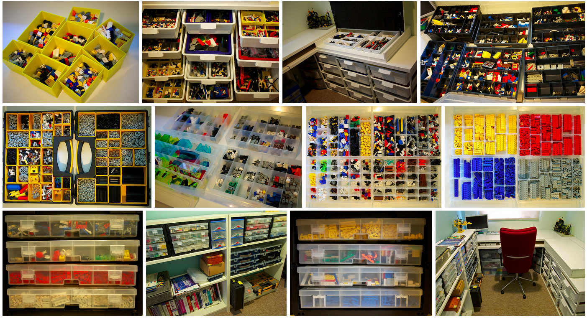

flickr.com/photos/rooreynolds/sets/72157631919554658

^ It’s sorted by type. Always sort by type. In little drawers in boxes. 

---


The Usual Suspects
flickr.com/photos/rooreynolds/83409830

^ Of course I don’t just collect it. I make stuff too. 

---


Who Wants to be a Millionaire
flickr.com/photos/rooreynolds/95488462

^ I call this ‘Who Wants to be a Millionaire

---


WOPR
flickr.com/photos/rooreynolds/83410013

^ This is the WOPR from War Games

---

flickr.com/groups/lego-vignettes

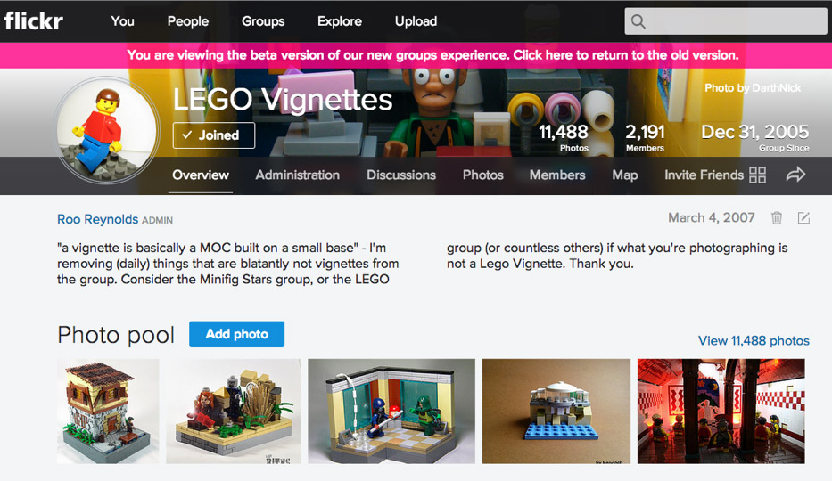

^ These small scenes are known in the AFOL (adult fans of Lego) community as Lego Vignettes, so I created a group on Flickr. 11k photos from 2k members

---


flickr.com/photos/kaptainkobold/103121238

^ One day, while looking at photos of Lego on Flickr, I saw another AFOL friend had taken a photo of his fridge from inside the fridge, with the door closed.

---


flickr.com/photos/rooreynolds/104688431

^ For some reason, this appealed to me enormously. So I copied him.

---


flickr.com/photos/rooreynolds/104688431
flickr.com/photos/minifig/104564652
flickr.com/photos/streeteye/2167711840
flickr.com/photos/wowser/4141251148

^ And it soon became something other people wanted to do

---

flickr.com/groups/inthefridge

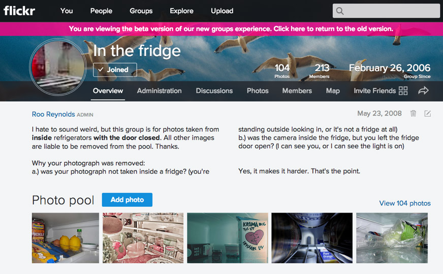

^ So I created a group for that. In the fridge. only 100 photos but each one has to follow very specific rules. 

---

flickr.com/groups/inthefridge


^ The rules are pretty important. 

---

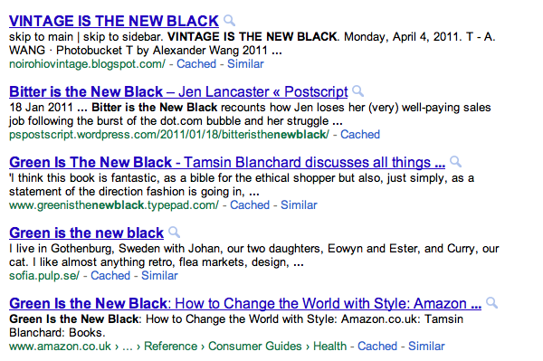

^ A few years ago, I noticed a lot of things were “the new black”

---


green is the new red
blood is the new black
fake is the new real
small is the new big
vegetarian is the new Prius
Quiet is the New Loud

^ And it turns out things are often the new something else. It’s a ‘snowclone’

---

````
digraph g {
  green  ->  red
  blood  ->  black
  fake   ->  real
  small  ->  big
  vegetarian -> Prius
  Quiet  -> New Loud
}
````
^ So I collected some in graphvis format.

---


^ Which makes it easy to make directed graphs like this automatically 

---


^ And I soon had this

----


flickr.com/photos/kellypuffs/2148506493

^ Which ended up in the Boston Globe. Which was nice.

---

*My wife’s gone the Caribbean*

**Jamaica?**

*No, she went of her own accord*

<br/>

*Last week, I want sailing in Poole.*

**In Dorset?**

*I’d recommend it to anyone*

^ My friend Nick and I really enjoy telling terrible jokes based on this format. 

---

shewentofherownaccord.com

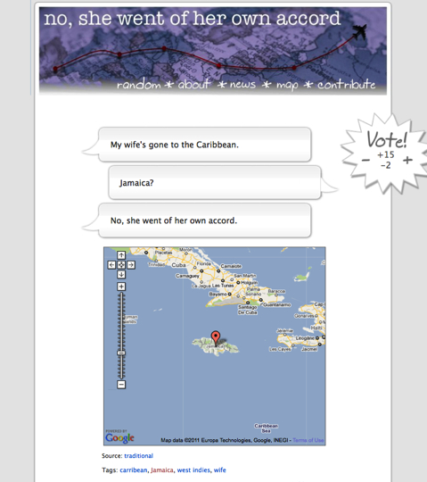 

---

shewentofherownaccord.com

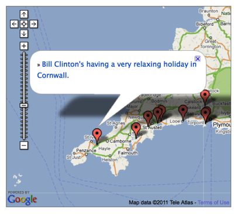 

---

shewentofherownaccord.com

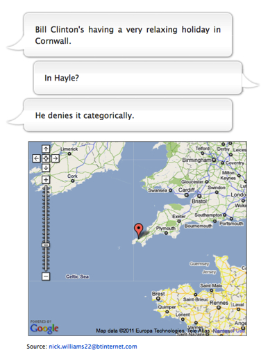 

---

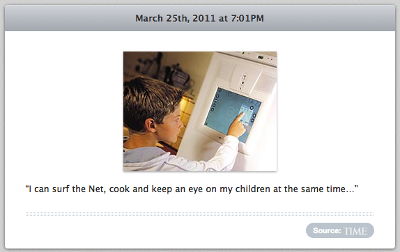 

^ For some time I’ve been intruigued / horrified by the concept of internet connected fridges

---

fuckyeahinternetfridge.tumblr.com

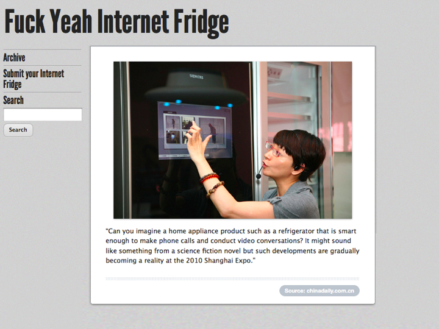 

^ So, um, I obviously created a Tumblr

---

fuckyeahinternetfridge.tumblr.com

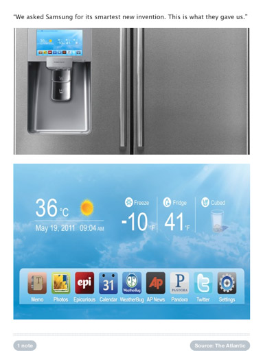 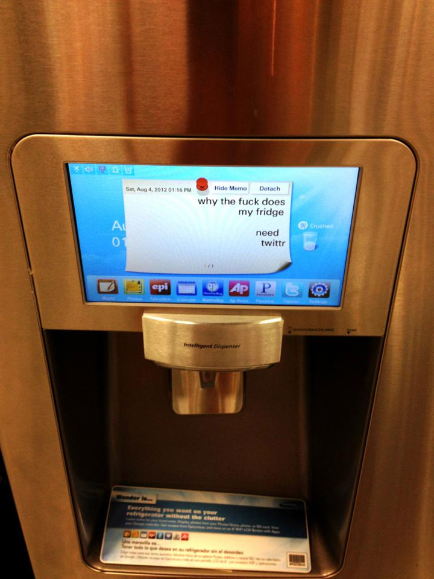

---

thingsridingonthings.tumblr.com

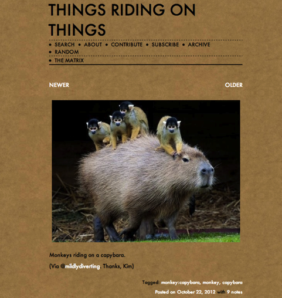 

^ More recently, I’ve started another ridiculous collection: photos and videos of things riding on the back of other things.

---

thingsridingonthings.tumblr.com

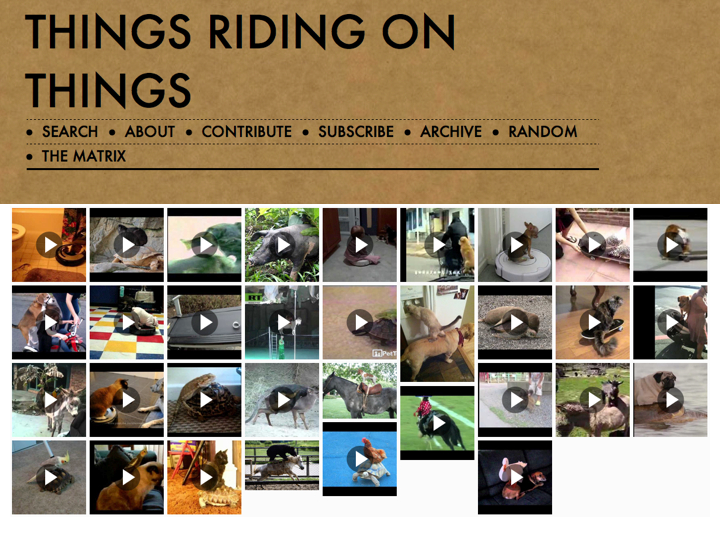 

^ YouTube appears to be literally full of videos of things riding on the back of other things. I go digging for them, but people suggest a couple of new ones every week.

---

thingsridingonthings.tumblr.com

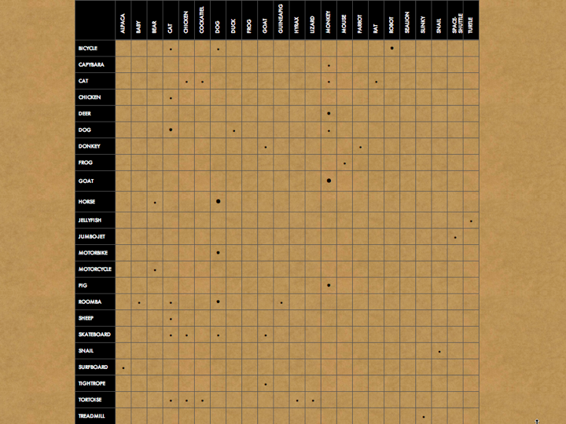 

^ It’s definitely not the only weird and super niche collection on Tumblr, but it’s the only one I know of with its own clickable matrix of things riding on the back of other things. Want a photo of a monkey riding on a pig? Just find the right row and column. The more examples there are in that category, the bigger the dot.

---

rooreynolds.com/roosletter

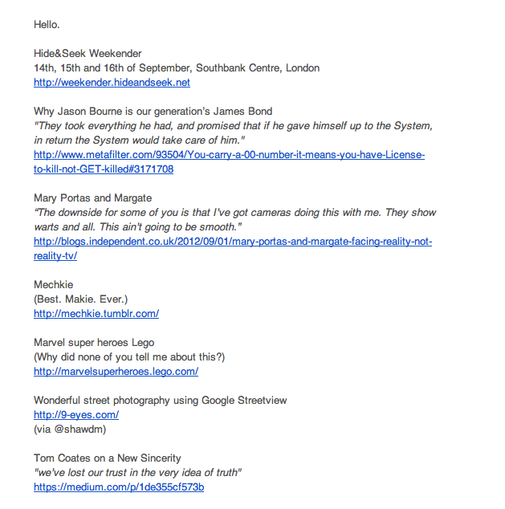 

^ A couple of years ago (after email newsletters were popular, but before it was popular again) I started collecting interesting links and sending out a regular email newsletter. 

^ As you might have noticed, email newsletters are all the rage again these days.

---

rooreynolds.com/roosletter

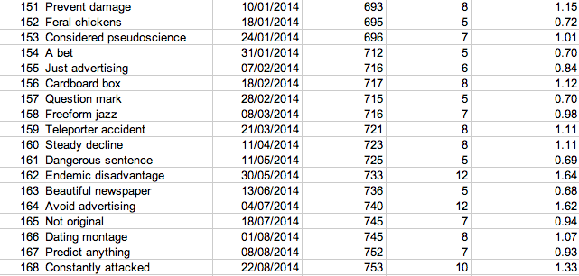 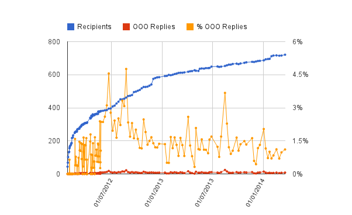

^ But, unlike most people, I’ve also been collecting the out of office replies that I get. 
And graphing them. Christmas and summer stand out.

---


flickr.com/photos/rooreynolds/13043990863

^ I got into lockpicking this year. which is mainly an excuse to collect different sorts of locks

---

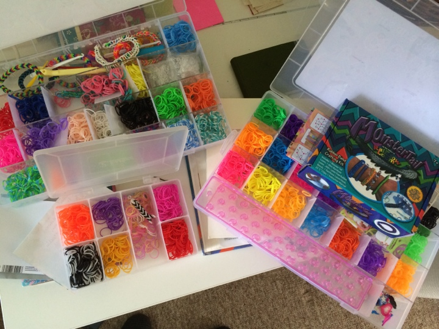

---

# Other people's collections

^ You get the general idea anyway. I’ve got some collections.

^ But other people’s colletions are way more fun than mine.

---

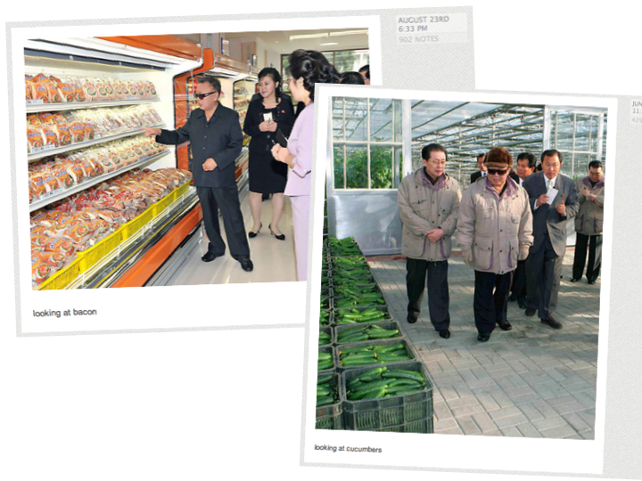

kimjongillookingatthings.tumblr.com

^ Like Kim Jong Il Looking at things. 

---

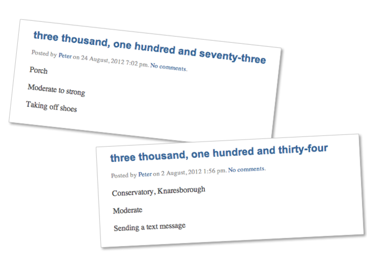

sneezecount.joyfeed.com

^ And Peter Fletcher’s sneeze count. He logs each sneeze (where, how strong, and what he was doing) which means he ends up with a collection of random moments. Skewed in favour of days when he has a cold or dusting. 

---

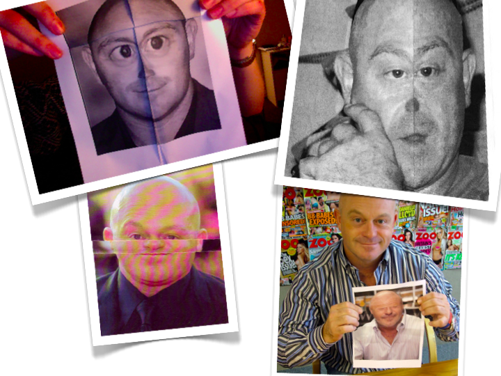

kempfolds.blogspot.co.uk

^ Probably my favourite: Kemp Folds is a collection of photos of Ross Kemp’s face, having been folded. 

^ Bottom right, Zoo magazine got him to fold himself. Kempception.

---

# Self reflection

^ Putting this presentation together gave me ample opportunity for self-reflection. I sort of want to justify myself. But:

^ I’m not going to tell you that constraints foster creativity.
^ I’m not going to tell you that curation of a public collection is an especially interesting form of co-creation in which issues of shared ownership are explored.
^ I’m not even going to tell you that by sharing a collection publicly it holds you accountable (to others and ultimately to yourself) which encourages you to keep at it.

^ All of those things are true, but I think it’s actually simpler than that.

---

 

flickr.com/photos/rooreynolds/7983104817

^ It’s a hobby. My dad’s hobby is making wooden toadstools. He whittled that. With his hands.
My dad has a stressful job, and he sometimes makes wooden toadstools to unwind. It gives his hands something interesting but unimportant to do, and helps him relax.

---


flickr.com/photos/dvortygirl/2376598010

^ Now, I know what you might be thinking; this is classic procrastination.

^ But my collections (and my Dad’s wooden toadstools) are not about intentional procrastination. ‘Sharpening pencils’ when you should be writing or drawing is risky because it’s too easy to confuse it with what you should be doing. If someone walks in on you sharpening your pencil you can claim to be just getting ready to start. If you’re collecting pictures of Colonel Gaddafi shaking hands with world leaders though (oh yes, that’s another one), then it’s pretty hard to convince anyone – let alone yourself – that you’re doing anything useful with your time.

---

 

flickr.com/photos/rooreynolds/7983104817

^ And that’s the point. It isn’t about making something useful. Collecting, or making, isn’t always about getting your day job done directly. Yes, it might help develop your taste, and it might even be beautiful in its own right, but the real benefit is letting your subconscious mind unwind. Not with something too taxing (or the stress returns), and not something too easy (otherwise your mind will wander). The perfect hobby is something that requires just enough attention for your conscious mind to become occupied with something interesting but unimportant, freeing your subconscious to wander around solving problems.

---

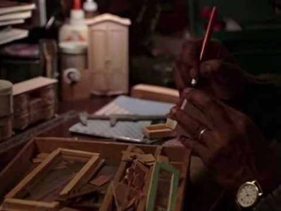 

^ Think of Lester Freamon in ‘The Wire’, quietly making his dollhouse miniature furniture. It’s a perfectly absorbing activity. Other people prefer to knit (someone at W+K used to knit in meetings, which might stop working when you get too good at it and can do it without thinkin at all). Some people write Haiku. We shouldn’t be surprised that people who spend a lot of time online have online hobbies too.

---

# Thank you

^ For me, my preferred way to relax is collecting things and putting them on the internet.

---

# Thank you 

rooreynolds.com/roosletter
shewentofherownaccord.com
fuckyeahinternetfridge.tumblr.com
thingsridingonthings.tumblr.com 
flickr.com/groups/lego-vignettes
flickr.com/groups/inthefridge/
rooreynolds.com/category/x-is-the-new-y
rooreynolds.com/category/meetimer-hacking/
