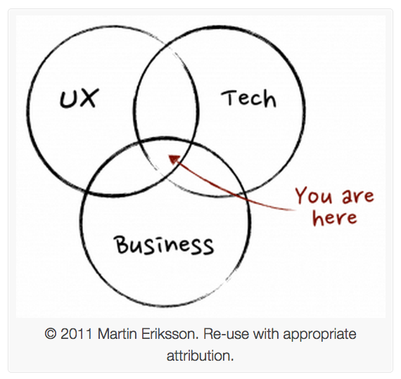

Roo Reynolds
@rooreynolds

# [fit] Good product management

---

# What is a product manager?

---

# ‘mini CEO’ ?

responsible
influence
usually without much formal authority

(not a great way to describe yourself to a team)

---

# ‘single wringable neck’ ??

responsible
committed
(but so is the rest of the team)

clear point of accountable contact

(not a great way to describe yourself to stakeholders)

---

## [fit] mindtheproduct.com/2011/10/what-exactly-is-a-product-manager

---

#Seven characteristics of good product management

---

## (IMHO)

---

# 1 - Putting users first

ensuring the team makes decisions 
based on data and user research, 
not instinct or just scratching our own itches
 

---

# 2 - Bringing the most useful problem for the team to solve next

having identified the most urgent things, 
the most useful things, the hardest things, 
what’s the current priority?

---

# 3 - Owning a prioritised backlog 

what are the next few things?
planning ahead (a bit)
not being the only one adding to backlog

---

# 4 - Not coming up with the solutions

(that's the team's job)
helping define testable hypotheses

---

# 5 - Listening. A lot.

being constantly aware of user feedback, data, research, what's hurting users most, what the team needs, internal priorities, external pressures...

---

# 6 - Defending the team

saying no to lots of requests, 
communicating upwards and outwards,
shielding the team from noise

--- 

# 7 - Strong opinions, weakly held [^1]

having a clear vision, 
while still being able to change your mind

[^1]: saffo.com/02008/07/26/strong-opinions-weakly-held

---

Roo Reynolds
@rooreynolds

# Thank you

---
