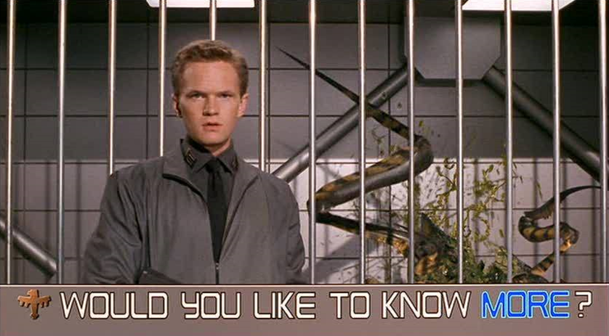
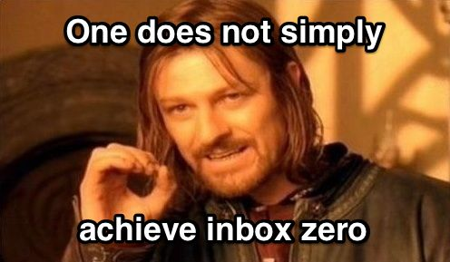
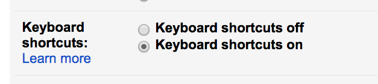
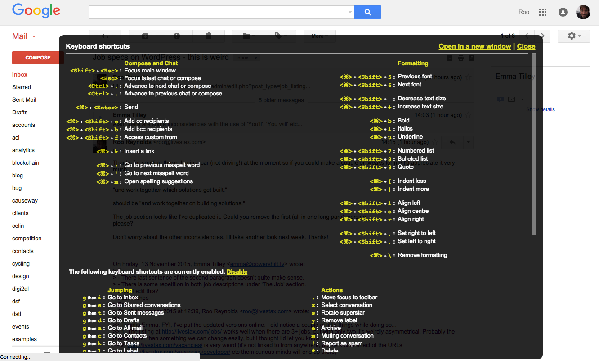
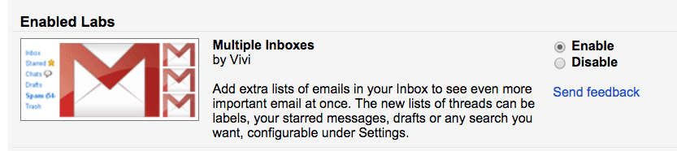
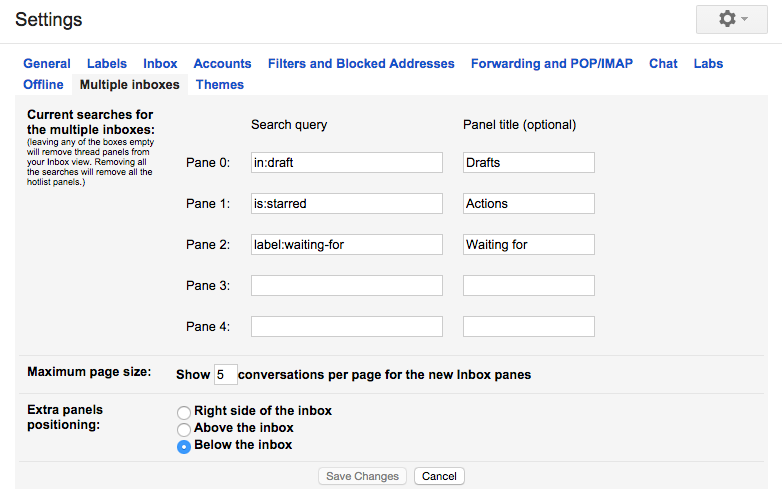
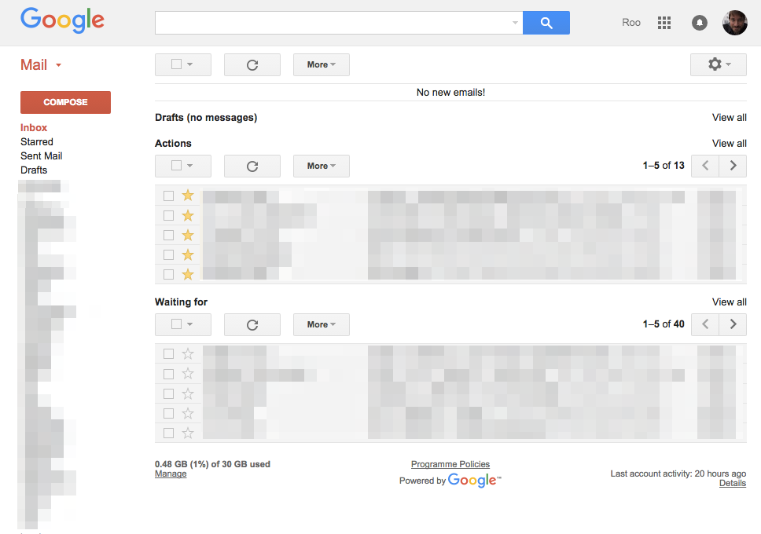
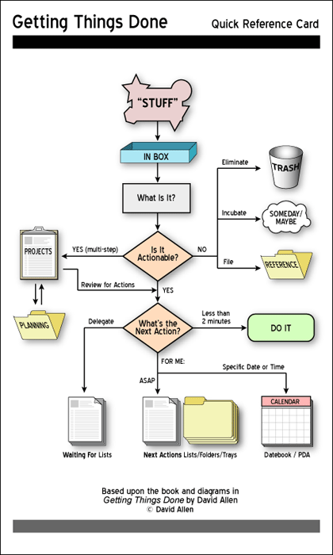

# [fit] Inbox zero
# :inbox_tray: :zero:

^ These are speaker notes

---

## Do you

Have a lot of unread email?

Experience email overload?

Waste time looking for and re-reading emails?

'Mark as unread' so you'll go back to deal with it?

Feel anxious that you're not getting back to people?

Worry about what's lurking in the middle of your inbox?

---

---

## Merlin Mann says

1. Don't leave your email client open. Process email periodically
2. *"I don't know"* is a good answer, as is *"do you still need this?"*
3. "It’s not how many mes­sages are in your inbox–it’s how much of your own brain is in that inbox"
4. It's a process, not a state. Especially not a state that requires significant infrequent effort
5. Delete, delegate, respond, defer, do

---

- Delete
- Delegate
- Respond
- Defer
- Do

---

- **Delete** :arrow_backward:
- Delegate
- Respond
- Defer
- Do

### First, delete/archive
### as many new messages as possible...
## :ballot_box_with_check:

---

- Delete
- **Delegate** :arrow_backward:
- Respond
- Defer
- Do

### ...then forward anything
### that can be best answered by someone else
## :arrow_right:

---

- Delete
- Delegate
- **Respond** :arrow_backward:
- Defer
- Do

### *Immediately* respond to any new messages
### that can be answered in two minutes or less
## :hourglass:

---

- Delete
- Delegate
- Respond
- **Defer** :arrow_backward:
- Do

### Will it take more than two minutes?
### Put it in a pile to deal with later...
## :file_folder:

---

- Delete
- Delegate
- Respond
- Defer
- **Do** :arrow_backward:

### ...and set aside time to respond to them.
### Obvs.
## :open_file_folder:

---

---

## Roo suggests

---

Turn on Gmail keyboard shortcuts

---

R = **r**eply
A = reply **a**ll
F = **f**orward
E = archiv**e**
S = **s**tar
L = add **l**abel
V = mo**v**e
[ = archive + next email

---

Turn on Multiple Inboxes (Gmail Labs feature)

---

See your starred emails directly below your inbox

---

See your starred emails directly below your inbox

---

If you liked that...

---

---

Roo Reynolds | @rooreynolds

# Thank you

http://www.43folders.com/topics/inbox-zero
http://gettingthingsdone.com/

---

# :inbox_tray: :zero:
